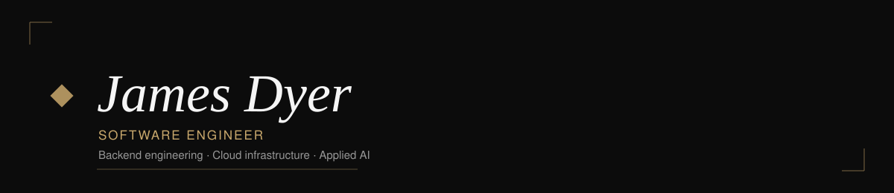

 

New graduate software engineer specializing in backend, full-stack, and AI systems.

 

### Featured projects

| | |
|---|---|
| **[macroTracker](https://github.com/James-Dyer/macro-tracker)** · **[Live app](https://james-dyer.github.io/macro-tracker/)** | AI-powered nutrition tracker that turns meal photos into structured macro data. Full-stack, live product with a serverless multimodal AI pipeline. `React 19` `TypeScript` `Supabase` `PostgreSQL` `Gemini API` |
| **[Software Engineering Tutor](https://github.com/James-Dyer/cse108-final)** | Guided learning platform with an in-browser Python IDE and LLM-driven, assignment-aware hints. One of three A+ final projects in UC Merced's full-stack course. `React` `Flask` `PostgreSQL` `Pyodide` |
| **[L-Game](https://github.com/James-Dyer/L-game)** | Reimplementation of Edward de Bono's L-Game with human, agent, and agent-vs-agent play using minimax, alpha-beta pruning, and heuristic state evaluation. `Python 3` `Game-tree search` |

 

### Experience

- **Capstone Team Lead**, E. & J. Gallo Winery — led a 5-person team building a computer vision system for factory part-wear measurement (<0.5mm mean absolute error); built the OpenCV calibration pipeline and operator-facing desktop app; owned CI infrastructure that ran the team's 29-test suite
- **Software Engineering Intern**, Mimic — built a Python integration-testing platform provisioning GCP infra, migrated cybersecurity engines to Rust-compiled WASM, resolved concurrency logging bugs in production Go services
- **Web Developer**, Sigma Chi (Lambda Delta) — built a React app with a real-time fundraising leaderboard used by 150+ participants

 

### Stack

 

Full case studies, screenshots, and writeups on <a href="https://james-dyer.github.io/portfolio-website/">james-dyer.github.io/portfolio-website</a>

